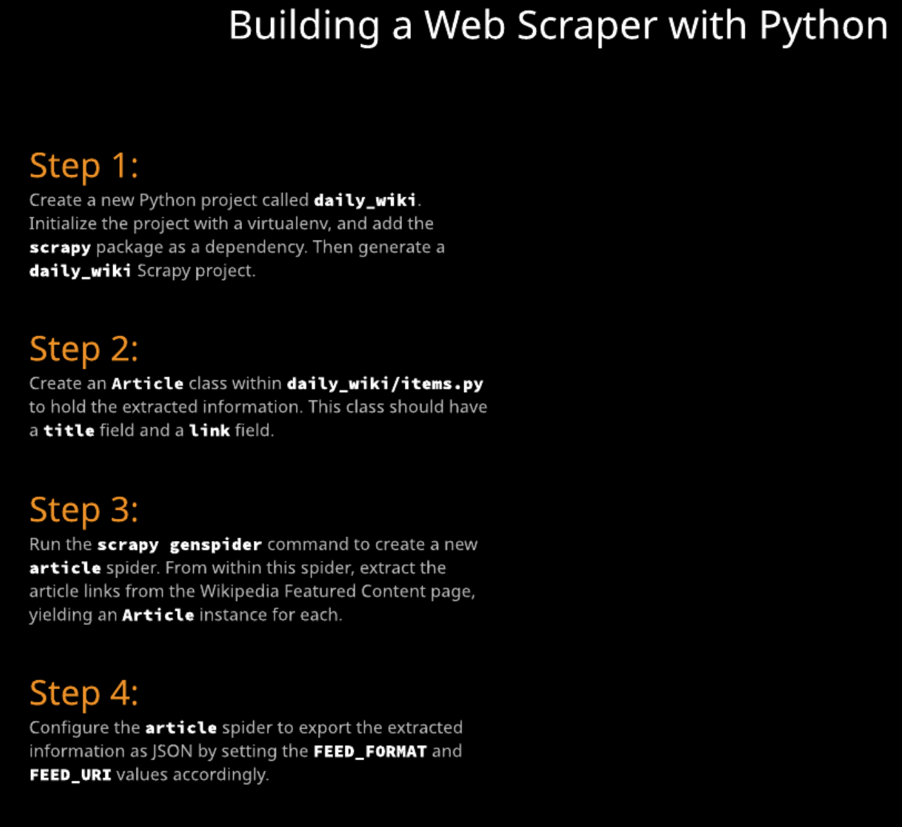

# DailyWiki: Building a Web Scraper with Python

Virtually limitless information is housed on the internet, but not all of it is accessible via APIs. Web scraping allows us to extract information from web pages so that we can use it in other applications or access it in different formats. In this hands-on lab, we will use [Scrapy](https://scrapy.org/) to create a web scraper that will fetch us Wikipedia's featured articles and export them as a JSON file that we can access later.



## Set Up a Project and Virtualenv using Pipenv and the Scrapy Generator
To set up our project, we're going to create a new directory with an internal directory of the same name (daily_wiki) to hold our scraper project:
```
$ mkdir daily_wiki
$ cd daily_wiki
```
Next, let's make sure that Pipenv is installed and then use it to create our virtualenv and install Scrapy:
```
$ pip3.7 install --user -U pipenv
...
$ pipenv --python python3.7 install scrapy
...
```
Once the virtualenv is created, we should activate it while working on this project:
```
$ pipenv shell
(daily_wiki) $
```
Lastly, we'll create our project using the Scrapy project generator:
```
(daily_wiki) $ scrapy startproject daily_wiki .
```
## Create an `Article` Item

Before we extract the information from the page, we need to set up a class that has fields for our Article within the daily_wiki/items.py file. This item will have a title field and a link field. By defining the item, we'll be able to have Scrapy automatically export information for us later on.

daily_wiki/items.py
```py
# -*- coding: utf-8 -*-

import scrapy

class Article(scrapy.Item):
    title = scrapy.Field()
    link = scrapy.Field()
```
Now we'll be able to yield one of these items for each of the links that we find on the featured content page.

## Create an Articles Spider

Almost all of the code that we need to write is going to go into a Scrapy spider. Thankfully, Scrapy's CLI provides a way to generate a spider. Let's do that now. This is a spider for articles, so we'll call it article, and our domain will be en.wikipedia.org.
```
(daily_wiki) $ scrapy genspider article en.wikipedia.org
Created spider 'article' using template 'basic' in module:
  daily_wiki.spiders.article
```
Now we have a file at daily_wiki/spiders/article.py that we'll be working in. The URL that we're going to be working with is https://en.wikipedia.org/wiki/Wikipedia:Featured_articles. If we take a look at this page, we can see that there are a lot of links. Thankfully, the links that are important to us share a common CSS class for the container called "featured_article_metadata", and the link is just an anchor within it. This is the only page we'll need to work with, so let's write our selector and loop to get this information into the parse method:

daily_wiki/spiders/article.py
```py
# -*- coding: utf-8 -*-
import scrapy

from daily_wiki.items import Article

class ArticleSpider(scrapy.Spider):
    name = 'article'
    allowed_domains = ['en.wikipedia.org']
    start_urls = ['https://en.wikipedia.org/wiki/Wikipedia:Featured_articles']

    def parse(self, response):
        host = self.allowed_domains[0]
        for link in response.css(".featured_article_metadata > a"):
            yield Article(
                title = link.attrib.get("title"),
                link = f"https://{host}{link.attrib.get('href')}"
            )
```
We can test this spider by running the following command:
```
(daily_wiki) $ scrapy crawl article
...
2019-08-09 14:46:38 [scrapy.core.engine] INFO: Closing spider (finished)
2019-08-09 14:46:38 [scrapy.statscollectors] INFO: Dumping Scrapy stats:
{'downloader/request_bytes': 585,
 'downloader/request_count': 2,
 'downloader/request_method_count/GET': 2,
 'downloader/response_bytes': 154870,
 'downloader/response_count': 2,
 'downloader/response_status_count/200': 2,
 'elapsed_time_seconds': 1.507018,
 'finish_reason': 'finished',
 'finish_time': datetime.datetime(2019, 8, 9, 18, 46, 38, 405739),
 'item_scraped_count': 3945,
 'log_count/DEBUG': 3947,
 'log_count/INFO': 10,
 'memusage/max': 51822592,
 'memusage/startup': 51822592,
 'response_received_count': 2,
 'robotstxt/request_count': 1,
 'robotstxt/response_count': 1,
 'robotstxt/response_status_count/200': 1,
 'scheduler/dequeued': 1,
 'scheduler/dequeued/memory': 1,
 'scheduler/enqueued': 1,
 'scheduler/enqueued/memory': 1,
 'start_time': datetime.datetime(2019, 8, 9, 18, 46, 36, 898721)}
2019-08-09 14:46:38 [scrapy.core.engine] INFO: Spider closed (finished)
```
It looks like we were able to scrSend Your ape 3945 items from the page (this number may vary if the page has changed). Now that we've successfully extracted the data, all that's left to do is configure Scrapy to export this information as JSON.

## Export Articles as JSON

Scrapy provides various configuration values that we can set to have it export a "feed". One easy way that we can do this is by adding a custom_settings attribute to our spider and setting the FEED_FORMAT and FEED_URI keys. Let's do this now. We'll set it to export as JSON and use a format of featured-articles-%(time).json within the /tmp directory:

daily_wiki/spiders/article.py
```py
# -*- coding: utf-8 -*-
import scrapy

from daily_wiki.items import Article

class ArticleSpider(scrapy.Spider):
    name = 'article'
    allowed_domains = ['en.wikipedia.org']
    start_urls = ['https://en.wikipedia.org/wiki/Wikipedia:Featured_articles']

    # Enable Feed Storage
    custom_settings = {
        'FEED_FORMAT': 'json',
        'FEED_URI': 'file:///tmp/featured-articles-%(time)s.json'
    }

    def parse(self, response):
        host = self.allowed_domains[0]
        for link in response.css(".featured_article_metadata > a"):
            yield Article(
                title = link.attrib.get("title"),
                link = f"https://{host}{link.attrib.get('href')}"
            )
```
Now if we run our crawler again and check the /tmp directory, we should see a new JSON file.

__Note:__ Your timestamp will be different.
```
(daily_wiki) $ scrapy crawl article
...
(daily_wiki) $ ls -al /tmp | grep featured
-rw-r--r--   1 cloud_user  wheel  377238 Aug  9 14:54 featured-articles-2019-08-09T18-54-38.json
```
We've successfully created a web scraper that can get the featured articles from Wikipedia and put them in a JSON file.