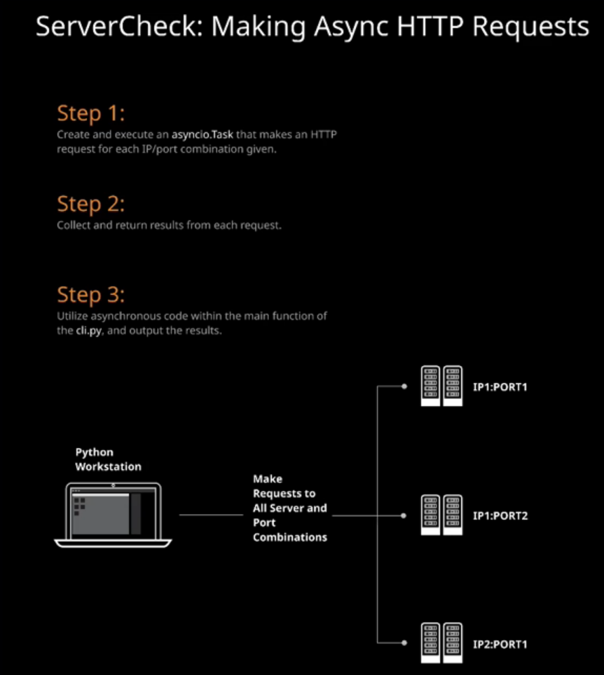

# Objective

Use Python to write a CLI that can take either a JSON file with servers and ports to check or a list of host/port combinations to make requests to. In this hands-on lab, we will take a list of server/port combinations and make HTTP requests concurrently so that we can get the status of our servers as quickly as possible. We'll also finalize the servercheck CLI.


## Commands

```
pip3.7 install --user pipenv
```

```
pipenv --python python3.7 install click
```

* Activate virtual env:
```
pipenv shell
```

* Makes it editable:
```
pip install -e .
```
```
servercheck -s "SERVER:1000:" -s "SERVER2:2000" -f example.json
```


## Notes

* A `set` is a sequence type where you cannot add a duplicate, if one is found it will be ignored


## Making Async HTTP Requests

__Objectives:__
* Create the http Module within the servercheck Package and Install requests
* Make Concurrent Requests and Return the Results
* Test Against Additional Servers Using REPL
* Utilize servercheck.http.ping_servers in the CLI Function



## Test Against Additional Servers Using REPL

```
(servercheck) $ DEBUG=true PYTHONPATH=. python
>>> from servercheck.http import ping_servers
>>> servers = ('web-node1:80', 'web-node2:80', 'web-node1:3000', 'web-node2:3000', 'web-node1:8080')
>>> ping_servers(servers)
Making request to web-node1:80
Making request to web-node2:80
Making request to web-node1:3000
Making request to web-node2:3000
Making request to web-node1:8080
Failed to connect to web-node1:3000
Received response from web-node1:80
Received response from web-node2:80
Received response from web-node2:3000
Received response from web-node1:8080
{'success': ['web-node1:80', 'web-node2:80', 'web-node2:3000', 'web-node1:8080'], 'failure': ['web-node1:3000']}
>>>
```

## Utilize servercheck.http.ping_servers in the CLI Function
```py
import click
import json
import sys
from .http import ping_servers


@click.command()
@click.option("--filename", "-f", default=None)
@click.option("--server", "-s", default=None, multiple=True)
def cli(filename, server):
    if not filename and not server:
        raise click.UsageError("must provide a JSON file or servers")

    # Create a set to prevent duplicate server/port combinations
    servers = set()

    # If --filename or -f option is used then attempt to read
    # the file and add all values to the `servers` set.
    if filename:
        try:
            with open(filename) as f:
                jsoprint(servers)n_servers = json.load(f)
                for s in json_servers:
                    servers.add(s)
        except:
            print("Error: Unable to open or read JSON file")
            sys.exit(1)

    # If --server or -s option are used then add those values
    # to the set.
    if server:
        for s in server:
            servers.add(s)

    # Make requests and collect results
    results = ping_servers(servers)
```
Now we can print the results to match our design goal:

servercheck/cli.py
```py
import click
import json
import sys
from .http import ping_servers


@click.command()
@click.option("--filename", "-f", default=None)
@click.option("--server", "-s", default=None, multiple=True)
def cli(filename, server):
    if not filename and not server:
        raise click.UsageError("must provide a JSON file or servers")

    # Create a set to prevent duplicate server/port combinations
    servers = set()

    # If --filename or -f option is used then attempt to read
    # the file and add all values to the `servers` set.
    if filename:
        try:
            with open(filename) as f:
                json_servers = json.load(f)
                for s in json_servers:
                    servers.add(s)
        except:
            print("Error: Unable to open or read JSON file")
            sys.exit(1)

    # If --server or -s option are used then add those values
    # to the set.
    if server:
        for s in server:
            servers.add(s)

    # Make requests and collect results
    results = ping_servers(servers)

    print("Successful Connections")
    print("---------------------")
    for server in results['success']:
        print(server)

    print("\n Failed Connections")
    print("------------------")
    for server in results['failure']:
        print(server)
```
Let's make sure that our package is installed into our virtualenv in an editable way before testing the final product:

(servercheck) $ pip install -e .
...

Next we'll create a test JSON file called example.json within our project's directory:
```json
[
    "web-node1:80",
    "web-node1:8000",
    "web-node1:3000",
    "web-node2:80",
    "web-node2:3000"
]
```
To test our tool, we can use the example.json and also pass some more information -s options to the servercheck executable.
```
(servercheck) $ servercheck -f example.json -s 'web-node1:80' -s 'web-node1:9000'
Successful Connections
----------------------
web-node1:80
web-node2:80
web-node2:3000
web-node1:8000

Failed Connections
------------------
web-node1:3000
web-node1:9000
```

You can also test using the DEBUG flag:

```
(servercheck) $ DEBUG=true servercheck -f example.json -s '52.3.232.163:80' -s '52.3.232.163:9000'
Making request to 3.235.44.220:3000
Making request to 3.235.44.220:80
Making request to 52.3.232.163:80
Making request to 52.3.232.163:3000
Making request to 52.3.232.163:9000
Making request to 52.3.232.163:8000
Failed to connect to 52.3.232.163:3000
Failed to connect to 52.3.232.163:9000
Received response from 3.235.44.220:3000
Received response from 3.235.44.220:80
Received response from 52.3.232.163:8000
Received response from 52.3.232.163:80
Successful Connections
---------------------
3.235.44.220:3000
3.235.44.220:80
52.3.232.163:8000
52.3.232.163:80

 Failed Connections
------------------
52.3.232.163:3000
52.3.232.163:9000
```